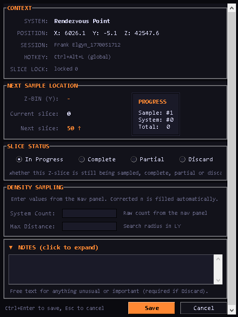
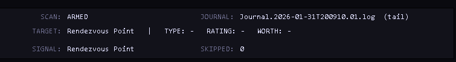
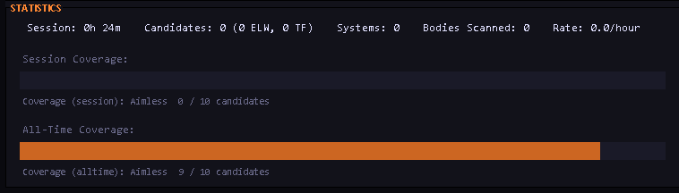
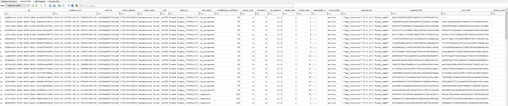
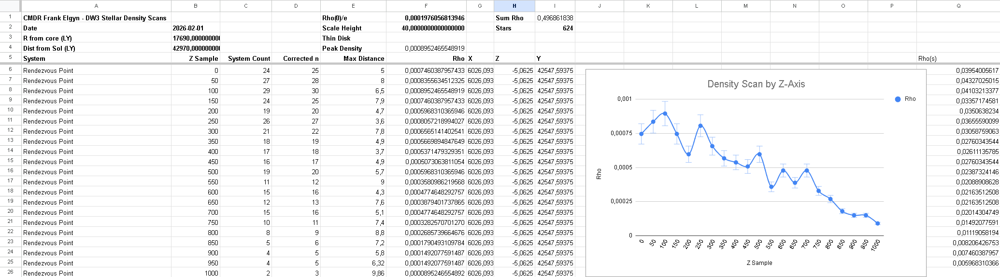
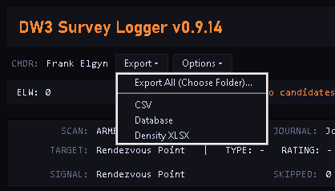
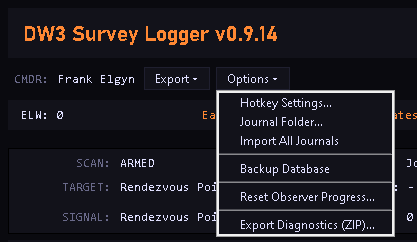

[](https://github.com/thebullbandit/dw3-survey-logger/releases)
[](LICENSE)

# DW3 Survey Logger v0.9.17


**Direct Download (Latest Stable v0.9.17):**

https://github.com/thebullbandit/dw3-survey-logger/releases/download/v0.9.17/DW3_Survey_Logger_Windows.zip

If Windows blocks the file:

Right click → Properties → Check Unblock → Apply

## Project Status

**This is still under development.**
It was created to support **DW3 expeditions**.

https://forums.frontier.co.uk/threads/dw3-distant-worlds-3-science-thread.643734/

Because development is ongoing, **bugs and rough edges should be expected**.

## Known Issues (v0.9.17)

None

---

## Overview

DW3 Survey Logger is for commanders participating in **DW3 (Distant Worlds Expedition 3)**.
It helps collect, structure, validate and export survey data from *Elite Dangerous* in a consistent way.

The logger combines:
- Automatic journal parsing from the game
- Human observations entered during flight
- Structured storage in a local SQLite database
- Export to spreadsheets (Density Survey/Boxel Size)

The result is clean and comparable data that DW3 teams can use without manual cleanup.

---

## Application Layout & Sections

Below is an overview of the main sections of the application and how they work together.

---

### 1. Survey Type Selection

When you press the observer hotkey (default: Ctrl+Shift+O), a selection dialog appears allowing you to choose between three survey types:

| # | Survey Type | Description |
|---|-------------|-------------|
| 1 | Regular Density Scan | 21 samples, 50 LY Z-bin increments (0-1000 LY) |
| 2 | Logarithmic Density Scan | 24 samples, variable increments (finer near galactic plane) |
| 3 | Boxel Size Survey | Single entry for highest-numbered system in boxel |

**Quick Selection:**
- Press 1, 2, or 3 on your keyboard to quickly select
- Press ESC to cancel
- Click on any survey type button to select

Each survey type opens its own specialized observation window with relevant fields.

---

### 2. Main Observation Screen



This is the primary workspace during flight.

Here you:
- See current system information
- Monitor sampling progress
- Enter observation values
- Complete samples when finished

**Multiple Windows:** You can have different survey types open simultaneously (e.g., Regular Density and Boxel Size windows open at the same time).

**Window Size Memory:** Each survey type remembers its own window size separately. Resize your Regular Density window, and it will restore that size next time.

---

### 3. Session & Sample Tracking

Each expedition run is organized into:
- **Sessions** (a continuous exploration period)
- **Samples** (individual measurement sets)

The logger automatically keeps track of:
- Z-bins
- Sample numbers
- Completion state

**Independent Counters:** Sample counts are tracked separately per survey type. Regular Density progress doesn't affect Logarithmic Density counts, and vice versa.

This ensures consistency across commanders and across time.

---

### 4. Journal Monitoring



The application continuously watches your **Elite Dangerous journal folder**.

It:
- Detects new journal entries in real time
- Parses only relevant events
- Ignores unrelated noise

No data is uploaded or shared automatically. Everything remains local on your machine.

**Import Historical Journals:** Use Options → Import All Journals to scan your old journal files and import existing discoveries. Error details are now shown in the comms panel if any issues occur during import.

---

### 5. Next Sample Location

The Observer Overlay shows your next sampling target while surveying.

It displays:
- **Z-BIN (Y)** - Your current z-bin
- **Current slice** - The slice you are currently in
- **Next slice** - The next z-bin to aim for, with direction arrow (↑/↓)
- **Progress** - Current sample number, system count, and total completed samples

Progress persists across app restarts. Direction is auto-detected after your second saved sample. No manual configuration needed.

---

### 6. ELW Scans & Activity Tier (Informational)



When scanning **Earth-Like Worlds (ELWs)**, the application displays a small activity tier indicator.

#### What the ELW Activity Tier Is

- A **local, personal indicator** based on your own ELW scan activity
- Designed purely for engagement and feedback


#### What the ELW Activity Tier Is *Not*

- Not a competition
- Not a ranking between commanders
- Not included in exported DW3 data

The activity tier has **zero impact** on:
- Data quality
- Validation
- DW3 worksheet exports
- Scientific usefulness

Two commanders with different ELW activity tiers can produce **equally valid data**.

#### Why It Exists

The ELW activity tier exists to add a light sense of progression **without turning science into competition**.

If it ever becomes distracting or controversial, it may be:
- Reworked
- Made optional
- Removed entirely

Community feedback will guide that decision.

---

### 7. Data Storage (SQLite)



All collected data is stored locally in a **SQLite database**.

Advantages:
- Fast and reliable
- Easy to back up
- No external services required
- Clear structure for later analysis

Both raw and processed values are preserved.

---

### 8. Export to DW3 Worksheets

 (Not a real sample!)

Completed samples can be exported to **DW3-compatible Excel worksheets**.

Exports include:
- Commander name
- Session and sample identifiers
- Measurement values
- Required metadata for DW3 analysis

**Distinct Filenames:** Export files are now clearly named by survey type:
- Regular Density: `DW3_Regular_Density_CMDR_Sample_01_...xlsx`
- Logarithmic Density: `DW3_Logarithmic_Density_CMDR_Sample_01_...xlsx`

**Export Options:**
- **Export All** - Exports CSV + Database + XLSX to a chosen folder via folder picker
- **Export from Overlay** - Quick export button in each survey window footer
- **Boxel Export** - Export Boxel Sheet directly from the Boxel Size survey window
- Selected export folder is remembered between sessions
- Clear success/failure indicators for each export

Files are named clearly so coordinators can identify them without opening the file.

---

### 9. Options & Configuration

 

The options menu (accessed via the Options dropdown button) allows you to:
- **Hotkey Settings** - Configure observer overlay hotkey
- **Import All Journals** - Bulk import historical journal data
- **Backup Database** - Quick database backup export
- **Reset Observer Progress** - Reset all sample progress to zero (data is preserved, not deleted)

The main Options dialog lets you:
- Select journal and output folders
- Adjust hotkey combinations

Settings persist across restarts.

---

## Ranking, Scoring & Intent

### This Is Not a Competitive Tool

DW3 Survey Logger is **not designed to rank commanders against each other**.

No commander is judged, compared or evaluated based on performance.

### Summary

- The app focuses on **data collection**
- It is **not a leaderboard**
- ELW activity tiers are local and purely for fun

---

## Installation

### Windows (Recommended)
1. Download the latest EXE from GitHub Releases
2. Run the application
3. Select your Elite Dangerous journal folder on first launch

### Troubleshooting

If the application doesn't start:
- **Antivirus:** Check if your AV quarantined the exe (common with PyInstaller apps)
- **Windows SmartScreen:** Right-click exe → Properties → Check "Unblock" → Apply
- **VC++ Runtime:** Install [Microsoft Visual C++ Redistributable](https://aka.ms/vs/17/release/vc_redist.x64.exe)
- **Run from CMD:** Open command prompt in the app folder and run the exe to see error messages

### Linux / Advanced Users
Either install with `uv` via `uv tool install git+https://github.com/thebullbandit/dw3-survey-logger` or via pip:

```bash
git clone https://github.com/thebullbandit/dw3-survey-logger
pip install dw3-survey-logger
```

Then simply run `dw3-survey-logger`.

---

## Current Limitations

- Some validation is still evolving

This limitation is expected at this stage of development.

---

## Roadmap

### Next Focus
- **Data validation**
  - Prevent incomplete or invalid samples
  - Stronger consistency checks before export

- **UI improvements**
  - Clearer feedback
  - Improved layout and readability

### Future Ideas
- Session summaries and statistics
- Guided workflows for new commanders

---

## Patch Notes

### v0.9.17

#### New Features
- **Survey Type Selection** - Choose between Regular Density (21 samples), Logarithmic Density (24 samples), or Boxel Size Survey when opening the observer overlay
- **Multiple Survey Windows** - Can have different survey types open simultaneously
- **Per-Survey Window Sizing** - Each survey type remembers its own window size independently
- **Distinct Export Filenames** - Regular vs Logarithmic density exports now have clearly different filenames
- **Export from Boxel Window** - Added Export button to Boxel Size survey footer for quick access

#### Improvements
- Separate Sample Counts - Regular and Logarithmic density surveys now track progress independently
- Journal Import Errors - Now shows specific error details in comms panel instead of just a count
- Safer Journal Import - Handles malformed data, None values, and type mismatches gracefully
- Excel Formula Fixes - "Dist from Sol" and "R from Core" columns now calculate correctly (no more #NAME? errors)

#### Technical
- Added `survey_type` column to database for filtering
- Added safe type conversions for journal import
- Fixed formula locale issues in Excel exports

### v0.9.16
- Added: Quick "Export" button added to the Add Observation footer so you can export density worksheets without leaving the overlay.
- Fixed: Observation window bottom clipping on Linux - window height now adapts to actual font rendering
- Fixed: The Add Observation window saves its size when closed and restores on next open/restart.
- Added: Next Slice Y now detects whether you're travelling up or down from your actual jumps. (Active after first jump)
- Added: A hint appears after saving your 20th Density sample, reminding you to save one more to complete the sample.
- Added: "Stellar Properties Boxel Size Survey" Added by request.

### v0.9.15
- Changed: "Flags" section is now hidden to reduce UI clutter.
- Changed: Removed visible Corrected n field from Observation, value is still calculated in the background.
- Improved: Updated the Max Distance tooltip

### v0.9.14
- Fixed: Sample progress now persists across app restarts instead of resetting to zero
- Fixed: Observation window bottom clipping on Linux - window height now adapts to actual font rendering
- Fixed: Removed stale "Jump ~XX LY upward" line from Next Sample Location panel
- Fixed: Density Excel export now writes the actual CMDR name to the sheet instead of using the template default
- Improved: Observation window is now scrollable and resizable - users can shrink the window without losing the Save/Cancel buttons
- Improved: Removed 20 system sample limit, users can now scan as many systems as they want per sample
- Added: Reset Observer Progress option in the Options menu (soft-reset, data preserved in database)
- Added: Cache cleanup on startup to prevent stale bytecode issues after updates

### v0.9.13
- Fixed: Sample index counter bug - Sample runs now correctly increment (1, 2, 3...) instead of staying at 1
- Fixed: Excel coordinate order - Columns now ordered as X-Y-Z instead of X-Z-Y for consistency
- Improved: Observation window workflow - Window no longer auto-closes after saving, allowing rapid data entry
- Improved: Compact UI design - Main window reduced to 650px width (from 900px), minimum 580px
- Improved: Observation window - Reduced to 480x380px with collapsible NOTES section that dynamically resizes
- Improved: UI organization - CMDR name moved to button line, new Options dropdown menu consolidating settings
- Improved: Reduced padding - Tightened spacing throughout for more compact layout
- Changed: Removed Rescan button - Moved to Options menu to reduce clutter
- Changed: Moved Import Journals - Now in Options dropdown menu
- Added: Backup Database option - Quick access in Options menu

### v0.9.12
- Fixed: Observer overlay now refreshes context when hotkey pressed after jumping
- Improved: Next Sample Location panel with clearer language and direction arrows
- Added: Export All option with folder picker for CSV + DB + XLSX
- Added: Folder selection for individual Density XLSX export

---

## Versioning Note

Recent releases focused primarily on internal stability.
Version numbering will stabilize once core behavior is fully locked in.

---

## Disclaimer

This project is **not officially affiliated with Frontier Developments or DW3 leadership**.
It is a community-built tool provided as-is.

---

## Feedback & Contributions

Bug reports and suggestions are welcome via GitHub Issues.
Please include logs and steps to reproduce where possible.

---

## Acknowledgements

- CMDRs testing early builds o7
- The DW3 expedition community
- Stellar Density Scan Worksheet created by CMDR Satsuma
- Distant Radio 33.05
- Frontier Development
